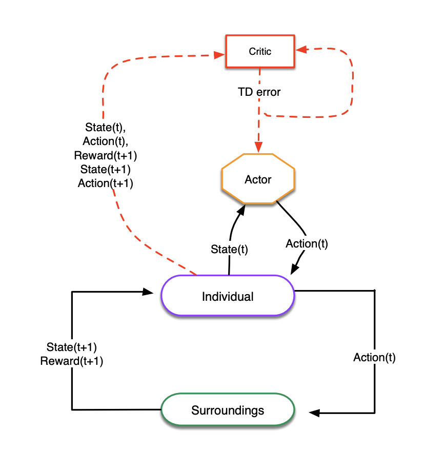
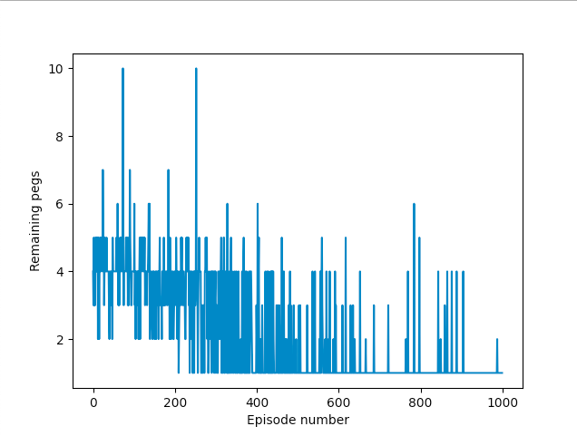

# aiprog

# Peg solitaire solver using Reinforcement Learning

This is the first of three projects in the AI programming course at NTNU. The groupe built a general-purpose Actor-Critic Reinforcement Learner and has applied it to different instances of the game Peg Solitaire. 

Figure 1 provides a high-level view of the system design.

**File structure:**
* agent
    * actor.py
    * critic.py
    * critic_nn.py
    * critic_dict.py
    * split_gd.py
* environment
    * board.py
    * diamond_board.py
    * enviroment.py
    * triangle_board.py
    
The configs folder consists of different configs that has been used for the different instances of this problem. In main.py it reads in these configs
and starts the whole training loop.

Progression of Learning           |  Visualization of Game Play
:-------------------------:|:-------------------------:
  | 
